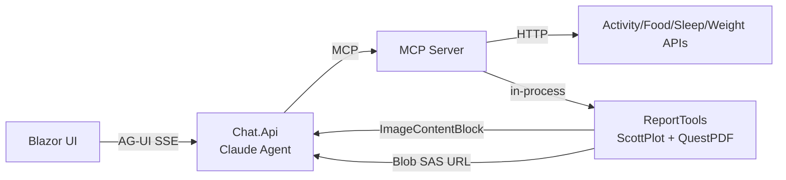
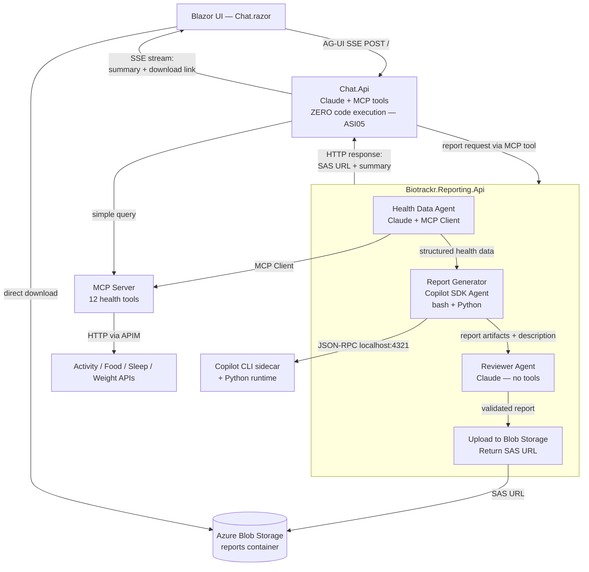

<!-- markdownlint-disable-file -->
# Task Research: Biotrackr Reporting Agent Architecture

Research into all viable architectural options for adding AI-powered report generation, visualization, and diet program capabilities to the Biotrackr health platform.

## Task Implementation Requests

* Add a reporting agent that can generate health reports (weekly/monthly summaries with charts)
* Add a diet program builder that analyzes food logs and creates meal plans
* Add trend analysis with visualizations (correlation analysis, trajectory charts)
* Integrate with existing Biotrackr architecture (Agent Framework, MCP Server, Container Apps)
* Maintain security posture (OWASP Agentic Top 10 compliance, managed identity where possible)

## Scope and Success Criteria

* Scope: All viable architectural approaches for adding code execution + report generation to Biotrackr, including framework choices, hosting models, security implications, and operational complexity
* Assumptions:
  * Biotrackr runs on Azure Container Apps with managed identity
  * Chat.Api uses Microsoft Agent Framework with Claude Sonnet 4.6 via Anthropic provider
  * MCP Server exposes 12 health data tools (activity, food, sleep, weight × 3 each)
  * UI is Blazor Server with AG-UI streaming chat
  * All infrastructure is Bicep-managed
  * This is a personal side project (cost sensitivity matters)
  * Biotrackr is open-source (MIT license)
* Success Criteria:
  * All viable options identified with pros/cons/complexity analysis
  * Security implications assessed per option
  * One recommended approach selected with full rationale
  * Implementation complexity estimated per option
  * Docker/Container App deployment considerations documented

## Research Executed

### File Analysis

* src/Biotrackr.Mcp.Server/Biotrackr.Mcp.Server/Tools/BaseTool.cs — Abstract base class with HTTP client, telemetry, date validation
* src/Biotrackr.Mcp.Server/Biotrackr.Mcp.Server/Tools/ActivityTools.cs — `[McpServerToolType]` pattern, 3 tools per domain
* src/Biotrackr.Chat.Api/Biotrackr.Chat.Api/Services/ChatAgentProvider.cs — Agent construction with MCP tools, middleware pipeline
* scripts/chat-system-prompt/system-prompt.txt — Tool-first strategy, no code execution constraint
* infra/modules/host/container-app-http.bicep — Single-container Container App module

### External Research

* GitHub Copilot SDK: https://github.com/github/copilot-sdk — v0.2.0, Technical Preview, JSON-RPC to CLI
  * Source: copilot-sdk-container-hosting.md subagent research
* Microsoft Agent Framework: https://github.com/microsoft/agent-framework — python-1.0.0rc5
  * `Microsoft.Agents.AI.GitHub.Copilot` package confirmed at dotnet/src/
  * `Agent_With_GitHubCopilot` sample confirmed at dotnet/samples/02-agents/AgentProviders/
* Azure Container Apps Dynamic Sessions: https://learn.microsoft.com/en-us/azure/container-apps/sessions
  * Source: azure-dynamic-sessions.md subagent research
* ScottPlot: https://www.nuget.org/packages/ScottPlot — v5.1.57, MIT, 4.1M downloads
* QuestPDF: https://www.nuget.org/packages/QuestPDF — v2026.2.4, Community license (free for FOSS)
* MathNet.Numerics: https://www.nuget.org/packages/MathNet.Numerics — v5.0.0, MIT, 59.9M downloads

### Project Conventions

* Standards referenced: Biotrackr MCP tool pattern (`[McpServerToolType]` + `[McpServerTool]`), Container App Bicep modules, managed identity auth
* Instructions followed: dotnet-best-practices, copilot-instructions.md

## Key Discoveries

### MCP Protocol Supports Binary Content Natively

The MCP specification supports `ImageContentBlock` (base64 PNG), `EmbeddedResourceBlock` (arbitrary binary including PDF), and mixed content responses from tools. The C# MCP SDK provides `ImageContentBlock.FromBytes()` for direct image return. This means report generation tools can return charts inline without external storage.

### .NET Chart + PDF Libraries Are Production-Ready

ScottPlot (MIT, headless `SavePng()`, 30+ chart types, DateTime axis) and QuestPDF (free for FOSS, fluent API, PDF/A compliance) cover all Biotrackr report generation needs. MathNet.Numerics provides Pearson correlation, linear regression, and descriptive statistics. The .NET stack is sufficient — Python is not required.

### Microsoft Agent Framework Has Official Copilot SDK Integration

`Microsoft.Agents.AI.GitHub.Copilot` NuGet package exists with `.AsAIAgent()` extension method. Copilot agents implement the same `AIAgent` interface and can participate in multi-agent workflows. The integration is real but the Copilot SDK is Technical Preview (v0.2.0).

### Copilot CLI Can Run Headlessly in Containers

The CLI supports `--headless --port N --bind 0.0.0.0` for server mode. Official Docker image at `ghcr.io/github/copilot-cli:latest`. Auth via environment variables (`GITHUB_TOKEN`). Session management supports concurrent sessions.

### Existing MCP Server Auto-Discovers New Tools

`WithToolsFromAssembly()` in Program.cs auto-discovers any class decorated with `[McpServerToolType]`. Adding a `ReportTools.cs` class requires zero infrastructure changes — the tool is immediately available to Chat.Api via the existing MCP client.

## Technical Scenarios

### Option A: GitHub Copilot SDK as Agent Framework Provider

**Architecture**: Chat.Api orchestrates a multi-agent workflow. Health Data Agent (Claude + MCP) fetches data, then hands off to a Copilot SDK agent (`Biotrackr.Report.Svc`) running in a separate Container App with the Copilot CLI. The Copilot agent writes and executes Python scripts using its built-in `bash` and `edit` tools to generate charts and PDFs.

**Requirements:**

* Copilot CLI installed in Docker image + Python 3 + matplotlib + pandas + reportlab
* GitHub Copilot subscription or BYOK with stored API key (no managed identity)
* New Container App (`biotrackr-report-svc`)
* Agent Framework workflow orchestration in Chat.Api
* Permission callback to restrict Copilot tools (allow bash/edit, deny git/web)

**Preferred Approach:** No — too complex for the value delivered.

```text
New files:
  src/Biotrackr.Report.Svc/
  src/Biotrackr.Report.Svc.UnitTests/
  src/Biotrackr.Report.Svc.IntegrationTests/
  infra/apps/report-svc.bicep
  .github/workflows/deploy-report-svc.yml
  Dockerfile (with Copilot CLI + Python)
Modified files:
  src/Biotrackr.Chat.Api/ (add workflow orchestrator)
  scripts/chat-system-prompt/system-prompt.txt
```

**Implementation Details:**

The Copilot SDK agent would use `copilotClient.AsAIAgent(sessionConfig)` to create an `AIAgent` within an Agent Framework sequential workflow. The agent's built-in `bash` tool executes Python scripts. Reports are LLM-driven (non-deterministic): the agent decides what Python code to write and run each time.

**Advantages:**
* Most flexible — can generate arbitrary visualizations and analyses
* Copilot handles planning and code execution orchestration
* Could do genuinely novel analyses (ad-hoc correlations, custom chart types)

**Limitations:**
* Technical Preview SDK (v0.2.0) — breaking changes expected
* Copilot CLI binary required in container image (~100 MB)
* Python + data science stack required in image (+200-260 MB)
* No managed identity for BYOK — must store API key as secret
* Non-deterministic: same request may produce different Python scripts
* Copilot subscription billing (premium request quota)
* Multi-agent orchestration complexity in Chat.Api
* New Container App, new deployment pipeline, new Bicep modules
* Container recommendation warning: "run in containerized environment for safety"

**Estimated Complexity:** Very High (new service + new framework dependency + multi-agent orchestration + 2-language container)

---

### Option B: Agent Framework + Python Sidecar Container

**Architecture**: A Python FastAPI sidecar runs alongside Chat.Api (or a new Report.Svc) in the same Container App. The .NET agent calls the Python sidecar via `localhost` HTTP. The sidecar exposes deterministic endpoints like `POST /generate-report` and `POST /generate-chart`.

**Requirements:**

* Separate Python Docker image with FastAPI + uvicorn + matplotlib + pandas + reportlab
* ACA sidecar container configuration in Bicep
* Shared EmptyDir volume for artifact exchange
* Refactoring of `container-app-http.bicep` module to support sidecars

**Preferred Approach:** No — introduces cross-language maintenance burden for capabilities achievable in pure .NET.

```text
New files:
  src/Biotrackr.Report.Sidecar/ (Python project)
  src/Biotrackr.Report.Sidecar/Dockerfile
  src/Biotrackr.Report.Sidecar/main.py
  src/Biotrackr.Report.Sidecar/requirements.txt
Modified files:
  infra/modules/host/container-app-http.bicep (add sidecar support)
  infra/apps/mcp-server.bicep or chat-api.bicep (add sidecar)
```

**Advantages:**
* Deterministic — predefined Python endpoints produce consistent output
* Python ecosystem access (matplotlib, pandas, seaborn)
* Sidecar shares network namespace — `localhost` HTTP is fast
* Isolated resource allocation

**Limitations:**
* Two-language codebase (C# + Python)
* Two build pipelines, two dependency ecosystems
* Sidecar image ~800 MB–1.2 GB (Python + matplotlib + pandas)
* Cold start: 2-5 sec for matplotlib import
* Bicep module refactoring required
* Two sets of security scanning (NuGet + pip)
* Resource overhead: ~0.5 vCPU / 1 GiB per replica for sidecar

**Estimated Complexity:** High (new Python project + Bicep changes + cross-language maintenance)

---

### Option C: Agent Framework + Azure Container Apps Dynamic Sessions

**Architecture**: Chat.Api creates an Agent Framework tool that calls Azure Container Apps Dynamic Sessions REST API. The tool sends Python code to an ephemeral, Hyper-V isolated sandbox. The sandbox executes the code and returns results + generated files.

**Requirements:**

* Session Pool resource (`Microsoft.App/sessionPools`) provisioned via Bicep
* Custom container image in ACR with pandas + matplotlib + reportlab (or use PythonLTS + runtime pip install)
* `Azure ContainerApps Session Executor` RBAC role assignment
* `DefaultAzureCredential` token for `https://dynamicsessions.io` audience
* Custom Agent Framework tool wrapping the REST API in Chat.Api

**Preferred Approach:** No — adds infrastructure and LLM-generated code execution for capabilities achievable deterministically in .NET.

```text
New files:
  infra/modules/compute/session-pool.bicep
  src/Biotrackr.Chat.Api/.../Tools/DynamicSessionTool.cs
  (optional) Dockerfile.sessions (custom Python image for session pool)
Modified files:
  infra/apps/chat-api.bicep (add session pool + RBAC)
  src/Biotrackr.Chat.Api/Program.cs (register tool)
  scripts/chat-system-prompt/system-prompt.txt
```

**Advantages:**
* Hyper-V isolation — strongest sandboxing of any option
* Managed identity supported (Entra auth to `https://dynamicsessions.io`)
* No Python in the .NET container — clean separation
* Subsecond cold start from prewarmed pools
* ~$0.03/session-hour (~<$1/month for Biotrackr usage)
* Egress disabled by default — prevents data exfiltration

**Limitations:**
* New infrastructure (session pool + RBAC + custom container in ACR)
* No .NET SDK — must wrap REST API manually with HttpClient
* LLM must generate correct Python code each time (non-deterministic)
* 220-second execution time limit per code block
* Custom container needed if reportlab is required (not pre-installed)
* File I/O requires separate REST calls (upload data, execute code, download artifacts)
* Preview API version (`2025-10-02-preview`)

**Estimated Complexity:** Medium-High (new infra + REST API wrapper + LLM code generation)

---

### Option D: Pure .NET MCP Report Tools (No Python, No Second Agent) — RECOMMENDED

**Architecture**: Add new report generation tools to the existing `Biotrackr.Mcp.Server` using ScottPlot (charts), QuestPDF (PDFs), and MathNet.Numerics (statistics). Claude calls these tools via MCP just like the existing 12 data tools. No new service, no new Container App, no new framework.

**Requirements:**

* ScottPlot, QuestPDF, and MathNet.Numerics NuGet packages added to MCP Server
* New `ReportTools.cs` tool class with `[McpServerToolType]`
* System prompt update to include report generation instructions
* (Optional) Azure Blob Storage for PDF artifact storage

**Preferred Approach:** Yes — lowest complexity, aligns with existing architecture, zero new infrastructure.

```text
New files:
  src/Biotrackr.Mcp.Server/Biotrackr.Mcp.Server/Tools/ReportTools.cs
  src/Biotrackr.Mcp.Server/Biotrackr.Mcp.Server/Services/ChartGenerator.cs
  src/Biotrackr.Mcp.Server/Biotrackr.Mcp.Server/Services/PdfReportBuilder.cs
  (tests for above)
Modified files:
  src/Biotrackr.Mcp.Server/Biotrackr.Mcp.Server.csproj (add NuGet refs)
  scripts/chat-system-prompt/system-prompt.txt (add report instructions)
```



**Implementation Details:**

New MCP tools:

```csharp
[McpServerToolType]
public class ReportTools(HttpClient httpClient, ILogger<ReportTools> logger)
    : BaseTool(httpClient, logger)
{
    [McpServerTool]
    [Description("Generates a weight trend chart. Returns a PNG image.")]
    public async Task<ImageContentBlock> GenerateWeightTrendChart(
        [Description("Start date (yyyy-MM-dd)")] string startDate,
        [Description("End date (yyyy-MM-dd)")] string endDate)
    {
        var data = await GetAsync<PaginationResponse<WeightItem>>(...);
        var plot = new ScottPlot.Plot();
        // ... configure weight trend line chart with DateTime axis ...
        byte[] png = plot.GetImageBytes(800, 400, ScottPlot.ImageFormat.Png);
        return ImageContentBlock.FromBytes(png, "image/png");
    }

    [McpServerTool]
    [Description("Generates a weekly health summary PDF report.")]
    public async Task<string> GenerateWeeklyReport(
        [Description("Start date (yyyy-MM-dd)")] string startDate,
        [Description("End date (yyyy-MM-dd)")] string endDate)
    {
        // Fetch all domain data, generate charts, compose QuestPDF document
        // Upload to Blob Storage, return SAS URL
    }

    [McpServerTool]
    [Description("Calculates correlation between two health metrics.")]
    public async Task<string> AnalyzeCorrelation(
        [Description("First metric: activity, sleep, weight, food")] string metric1,
        [Description("Second metric")] string metric2,
        [Description("Start date")] string startDate,
        [Description("End date")] string endDate)
    {
        // Fetch both datasets, use MathNet.Numerics Correlation.Pearson()
        // Return JSON with coefficient, significance, trend description
    }
}
```

**Advantages:**

* Zero new infrastructure — tools auto-discovered by `WithToolsFromAssembly()`
* Zero new services, deployments, or Container Apps
* Single language, single build pipeline, single dependency ecosystem
* Deterministic output — same inputs produce same charts/PDFs
* Fast — in-process generation, <1 sec cold start
* All libraries MIT or FOSS-compatible
* Managed identity preserved — no stored API keys
* MCP binary content support confirmed (ImageContentBlock, EmbeddedResourceBlock)
* Minimal image size increase (~36 MB for QuestPDF, ScottPlot is lightweight)
* Follows existing Biotrackr patterns exactly

**Limitations:**

* Couples report generation with MCP Server (shared failure blast radius)
* ScottPlot has ~30 chart types vs. matplotlib's 100+ (sufficient for health data)
* No ad-hoc analysis — reports must be predefined as tools
* Heavy report generation could affect MCP Server responsiveness (mitigated: QuestPDF generates "thousands of pages per second")
* Chart rendering requires `libfontconfig1` in container image (verify)

**Estimated Complexity:** Low (NuGet packages + new tool class + system prompt update)

---

### Option E: Agent Framework + Process.Start Python In-Container

**Architecture**: A .NET Container App (`Biotrackr.Report.Svc`) spawns Python scripts via `Process.Start()`. Python + pip packages are installed alongside .NET in the same Docker image.

**Preferred Approach:** No — code smell for greenfield development. Pure .NET alternatives exist.

**Advantages:**
* Full Python ecosystem access
* Deterministic — bundled scripts, not LLM-generated

**Limitations:**
* Image size doubles (~435-480 MB)
* No process-level sandboxing within the container
* Two-runtime debugging complexity
* Two dependency ecosystems in one build
* Risk of hanging processes, memory exhaustion, zombie processes
* Industry guidance: "code smell for greenfield when .NET alternatives exist"

**Estimated Complexity:** Medium (new service + dual-runtime container + process management)

---

### Option F: Separate Biotrackr.Report.Svc with .NET Report Generation

**Architecture**: Same as Option D (.NET libraries for reports) but deployed as a separate Container App service. Chat.Api orchestrates via Agent Framework multi-agent workflow or direct HTTP calls.

**Preferred Approach:** No for v1 — unnecessary complexity when the MCP Server can host the tools directly. Consider for v2 if report generation needs independent scaling.

**Advantages:**
* Isolated failure blast radius
* Independent scaling for report-heavy workloads
* Clean separation of concerns

**Limitations:**
* Full new service infrastructure (Container App, Bicep, deployment pipeline, identity, app config)
* Multi-agent orchestration or new HTTP integration in Chat.Api
* Higher operational overhead for a personal project

**Estimated Complexity:** Medium (new service using familiar patterns)

---

## Alternatives Comparison Matrix

| Dimension | A: Copilot SDK | B: Python Sidecar | C: Dynamic Sessions | **D: MCP Tools (Rec.)** | E: Process.Start | F: Separate .Svc |
|---|---|---|---|---|---|---|
| **New services** | 1 | 0 (sidecar) | 0 (pool) | **0** | 1 | 1 |
| **New infra** | Container App + Copilot CLI | Sidecar Bicep | Session Pool + RBAC | **None** | Container App | Container App |
| **Languages** | C# + Python | C# + Python | C# + Python (sandbox) | **C# only** | C# + Python | C# only |
| **Deterministic output** | No (LLM writes code) | Yes | No (LLM writes code) | **Yes** | Yes | Yes |
| **Sandboxing** | CLI process + permissions | Container isolation | **Hyper-V** | In-process | None | Container isolation |
| **Managed identity** | No (BYOK key-only) | Yes | **Yes** | **Yes** | Yes | Yes |
| **Image size delta** | +300 MB (CLI + Python) | +800 MB (Python image) | 0 (external) | **+~50 MB (NuGet)** | +260 MB (Python) | +~50 MB (NuGet) |
| **Cold start impact** | 3-5 sec | 2-5 sec | <1 sec (prewarmed) | **<1 sec** | 2-5 sec | <1 sec |
| **Monthly cost** | Copilot quota | ~$5 (sidecar resources) | ~$1 (sessions) | **$0** | ~$5 (new app) | ~$5 (new app) |
| **Complexity** | Very High | High | Medium-High | **Low** | Medium | Medium |
| **Flexibility** | Highest (arbitrary code) | High | High | Medium (predefined) | High | Medium |
| **Production readiness** | Preview (v0.2.0) | GA | Preview API | **GA (all libs)** | GA | GA |

## Selected Approach: Option D — Pure .NET MCP Report Tools

### Rationale

1. **Lowest complexity** — Zero new services, zero new infrastructure, zero new deployment pipelines. New tool class is auto-discovered by the existing `WithToolsFromAssembly()` registration.

2. **Follows existing patterns exactly** — The MCP Server already has 12 tools across 4 domains using `[McpServerToolType]`. Adding a `ReportTools` class is identical to the existing pattern.

3. **All libraries are GA and production-proven** — ScottPlot (MIT, 4.1M downloads), QuestPDF (free for FOSS, 18.6M downloads), MathNet.Numerics (MIT, 59.9M downloads). No preview SDKs.

4. **Preserves security posture** — Managed identity preserved. No stored API keys. No code execution. Deterministic output. No new attack surface.

5. **Cost-optimal for a side project** — $0 incremental cost. No Copilot subscription, no session pool billing, no additional Container App.

6. **Deterministic** — Same inputs produce identical reports. No LLM-generated Python scripts that may vary or fail unpredictably.

7. **Sufficient for health data** — ScottPlot covers line/bar/scatter/pie/heatmap/histogram/regression plots. QuestPDF handles multi-page PDF composition. MathNet.Numerics provides Pearson correlation, linear regression, and descriptive statistics. This covers weekly reports, trend charts, diet analysis, and correlation studies.

8. **Upgrade path** — If report generation eventually needs independent scaling or more exotic visualizations, Option F (separate .Svc with the same .NET libraries) is a straightforward extraction. Option C (Dynamic Sessions) is also available as a future enhancement for ad-hoc analysis.

### Rejected Alternatives Summary

* **Option A (Copilot SDK):** Compelling technology but extreme complexity for a side project. Technical Preview SDK, no managed identity for BYOK, non-deterministic LLM code generation, new Container App, multi-agent orchestration. Better suited for a product where ad-hoc flexible analysis is the core value proposition.

* **Option B (Python Sidecar):** Introduces cross-language maintenance burden for capabilities fully achievable in .NET. Two build pipelines, two dependency ecosystems, Bicep refactoring, ~800 MB sidecar image.

* **Option C (Dynamic Sessions):** Strongest sandboxing, but adds infrastructure (session pool, RBAC, custom container image) and relies on LLM-generated Python code. Preview API. Worth revisiting if deterministic .NET tools prove insufficient.

* **Option E (Process.Start):** Industry-recognized code smell for greenfield. Doubles image size, no process-level sandboxing, two-runtime debugging complexity.

* **Option F (Separate .Svc):** Same .NET approach as Option D but in a separate service. Unnecessary overhead for v1. Natural upgrade path if scaling demands it later.

## Implementation Roadmap

### Phase 1: Chart Generation MCP Tools

* Add ScottPlot + MathNet.Numerics NuGet packages to MCP Server
* Create `ChartGenerator.cs` service with methods for each chart type
* Create `ReportTools.cs` with `GenerateWeightTrendChart`, `GenerateActivityChart`, `GenerateSleepChart`
* Return charts as `ImageContentBlock` (base64 PNG)
* Update system prompt to instruct Claude on report tool usage
* Unit tests for chart generation

### Phase 2: PDF Report Composition

* Add QuestPDF NuGet package
* Create `PdfReportBuilder.cs` service for composing multi-page reports
* Add `GenerateWeeklyReport` MCP tool
* (Optional) Add Azure Blob Storage integration for PDF storage + SAS URLs
* Integration tests

### Phase 3: Analysis Tools

* Add `AnalyzeCorrelation` tool (Pearson correlation between metrics)
* Add `GenerateTrendAnalysis` tool (linear regression + forecast)
* Add `GenerateDietSummary` tool (calorie/macro analysis from food data)

### Phase 4: Enhanced Reporting (Future)

* If needed: Extract to `Biotrackr.Report.Svc` for independent scaling
* If ad-hoc analysis needed: Add Azure Dynamic Sessions as supplementary tool
* If VS Code integration desired: Add thin Copilot Extension proxy to MCP Server

## Potential Next Research

* Verify ScottPlot headless rendering in `mcr.microsoft.com/dotnet/aspnet:10.0` container (font dependencies)
* Prototype QuestPDF weekly health report layout
* Research how Blazor UI renders `ImageContentBlock` from Claude responses via AG-UI
* Investigate whether Claude passes through image content blocks to the streamed response or only uses them for reasoning
* Research Azure Blob Storage SAS URL generation with managed identity for PDF delivery

## Option A Deep Dive: Multi-Agent Report Generation with Copilot SDK

### Design Principles

1. **ASI05 boundary preservation** — Chat.Api maintains zero code execution. All Python/Copilot execution is isolated in `Biotrackr.Reporting.Api`.
2. **Long-term artifact storage** — Reports persist in Azure Blob Storage for retrieval and future analysis.
3. **Follows existing patterns** — New service uses the same Bicep module, managed identity, APIM gateway, and App Config patterns as every other Biotrackr service.

### Architecture Overview



### Service Layout

```text
src/
  Biotrackr.Chat.Api/                         ← MODIFIED (minor)
    (no Copilot SDK, no code execution, no new dependencies)
    System prompt updated to use GenerateReport MCP tool

  Biotrackr.Reporting.Api/                     ← NEW SERVICE
    Biotrackr.Reporting.Api/
      Configuration/
        Settings.cs
      Services/
        ReportWorkflowProvider.cs              ← Builds 3-agent workflow
        CopilotClientFactory.cs                ← Manages CopilotClient lifecycle
        BlobStorageService.cs                  ← Upload reports, generate SAS URLs
        McpToolService.cs                      ← Connects to existing MCP Server
      Endpoints/
        ReportEndpoints.cs                     ← POST /api/reports/generate
        ReportRetrievalEndpoints.cs            ← GET /api/reports/{id}
      Prompts/
        health-data-agent-prompt.txt
        report-generator-prompt.txt
        reviewer-prompt.txt
      Program.cs
      Dockerfile                               ← .NET only (no Python, no CLI)
    Biotrackr.Reporting.Api.UnitTests/
    Biotrackr.Reporting.Api.IntegrationTests/
    Biotrackr.Reporting.Api.slnx
    coverage.runsettings

  Biotrackr.Mcp.Server/                        ← MODIFIED (add 1 new tool)
    Tools/
      ReportTools.cs                           ← NEW: GenerateReport proxy tool

scripts/
  chat-system-prompt/
    system-prompt.txt                          ← MODIFIED: mention report tool

infra/
  apps/
    reporting-api/                              ← NEW
      main.bicep                               ← Container App + Copilot sidecar
  modules/
    storage/
      storage-account.bicep                    ← NEW MODULE
      blob-container.bicep                     ← NEW MODULE
  core/
    main.bicep                                 ← MODIFIED: add storage account

.github/
  workflows/
    deploy-reporting-api.yml                   ← NEW
    build-copilot-python-image.yml             ← NEW
```

### How Chat.Api Triggers Reports (ASI05 Preserved)

Chat.Api never touches the Copilot SDK or Python. Instead, a new MCP tool on the MCP Server acts as a proxy:

```csharp
// In Biotrackr.Mcp.Server/Tools/ReportTools.cs
[McpServerToolType]
public class ReportTools(HttpClient httpClient, ILogger<ReportTools> logger)
    : BaseTool(httpClient, logger)
{
    [McpServerTool]
    [Description("Generates a health report (weekly summary, trend chart, diet analysis). " +
                 "Returns a download URL for the generated PDF and a text summary.")]
    public async Task<string> GenerateReport(
        [Description("Report type: weekly_summary, monthly_summary, trend_analysis, " +
                     "diet_analysis, correlation_report")] string reportType,
        [Description("Start date (yyyy-MM-dd)")] string startDate,
        [Description("End date (yyyy-MM-dd)")] string endDate)
    {
        if (!IsValidDateRange(startDate, endDate))
            return "Invalid date range. Use yyyy-MM-dd format.";

        // Call Reporting.Api via APIM (same pattern as all inter-service calls)
        var response = await httpClient.PostAsJsonAsync(
            "/reporting/api/reports/generate",
            new { reportType, startDate, endDate });

        if (!response.IsSuccessStatusCode)
            return $"Report generation failed: {response.StatusCode}";

        var result = await response.Content.ReadFromJsonAsync<ReportResult>();
        return JsonSerializer.Serialize(result);
        // Returns: { "reportUrl": "https://...blob.../report.pdf?sv=...",
        //            "summary": "Weekly report for March 10-16...",
        //            "charts": ["https://...blob.../chart1.png?sv=..."] }
    }
}
```

Claude in Chat.Api calls this tool like any other MCP tool. The code execution happens entirely inside `Biotrackr.Reporting.Api` — Chat.Api only sees a URL and a summary string.

### Biotrackr.Reporting.Api — Internal Architecture

The Reporting.Api hosts the 3-agent workflow and the Copilot CLI sidecar:

```csharp
// Program.cs
var builder = WebApplication.CreateBuilder(args);

// Azure App Config (same pattern as all services)
builder.Configuration.AddAzureAppConfiguration(options =>
{
    options.Connect(new Uri(builder.Configuration["azureappconfigendpoint"]),
        new DefaultAzureCredential(new DefaultAzureCredentialOptions
        {
            ManagedIdentityClientId = builder.Configuration["managedidentityclientid"]
        }));
});

// Services
builder.Services.AddSingleton<ReportWorkflowProvider>();
builder.Services.AddSingleton<BlobStorageService>();
builder.Services.AddSingleton<McpToolService>();        // Reuse same MCP client pattern
builder.Services.AddSingleton<CopilotClientFactory>();
builder.Services.AddHealthChecks();

var app = builder.Build();

// Endpoints
app.MapPost("/api/reports/generate", ReportEndpoints.GenerateReport);
app.MapGet("/api/reports/{id}", ReportRetrievalEndpoints.GetReport);
app.MapGet("/api/healthz", () => Results.Ok(new { status = "healthy" }));

app.Run();
```

### The 3-Agent Workflow

```csharp
// ReportWorkflowProvider.cs
public class ReportWorkflowProvider
{
    private readonly Settings _settings;
    private readonly BlobStorageService _blobService;
    private readonly McpToolService _mcpToolService;
    private readonly CopilotClientFactory _copilotFactory;

    public async Task<ReportResult> GenerateReportAsync(
        string reportType, string startDate, string endDate, CancellationToken ct)
    {
        // Agent 1: Health Data Agent (Claude + MCP tools)
        var mcpTools = await _mcpToolService.GetToolsAsync();
        AnthropicClient anthropic = new() { ApiKey = _settings.AnthropicApiKey };
        AIAgent healthDataAgent = anthropic.AsAIAgent(
            model: _settings.ChatAgentModel,
            name: "HealthDataAgent",
            instructions: _settings.HealthDataPrompt,
            tools: [.. mcpTools]);

        // Agent 2: Report Generator (Copilot SDK)
        var copilotClient = await _copilotFactory.GetClientAsync();
        AIAgent reportGenerator = copilotClient.AsAIAgent(
            sessionConfig: new SessionConfig
            {
                AvailableTools = ["bash", "edit", "create_file", "view"],
                WorkingDirectory = "/tmp/reports",
                SystemMessage = new() { Mode = SystemMessageMode.Replace,
                                        Content = _settings.ReportGeneratorPrompt }
            },
            name: "ReportGenerator");

        // Agent 3: Reviewer (Claude, no tools)
        AIAgent reviewer = anthropic.AsAIAgent(
            model: _settings.ChatAgentModel,
            name: "ReportReviewer",
            instructions: _settings.ReviewerPrompt,
            tools: []);

        // Build and execute sequential workflow
        Workflow workflow = AgentWorkflowBuilder.BuildSequential(
            healthDataAgent, reportGenerator, reviewer);

        var prompt = $"Generate a {reportType} report for {startDate} to {endDate}. " +
                     "Fetch all relevant health data, generate charts, and produce a PDF.";

        await using StreamingRun run = await InProcessExecution
            .RunStreamingAsync(workflow, new ChatMessage(ChatRole.User, prompt));
        await run.TrySendMessageAsync(new TurnToken(emitEvents: true));

        // Collect workflow output
        string reviewerSummary = "";
        await foreach (var evt in run.WatchStreamAsync())
        {
            if (evt is WorkflowOutputEvent output)
                reviewerSummary = output.Data?.ToString() ?? "";
        }

        // Upload artifacts from /tmp/reports to Blob Storage
        var artifacts = await UploadArtifactsAsync(reportType, startDate, ct);

        return new ReportResult
        {
            ReportId = Guid.NewGuid().ToString(),
            ReportUrl = artifacts.PdfUrl,
            Charts = artifacts.ChartUrls,
            Summary = reviewerSummary,
            GeneratedAt = DateTimeOffset.UtcNow,
            DateRange = new { Start = startDate, End = endDate },
            ReportType = reportType
        };
    }
}
```

### Blob Storage Integration

```csharp
// BlobStorageService.cs
public class BlobStorageService
{
    private readonly BlobServiceClient _blobClient;
    private const string ReportsContainer = "reports";

    public BlobStorageService(Settings settings)
    {
        // Managed identity — no stored keys
        _blobClient = new BlobServiceClient(
            new Uri(settings.BlobStorageEndpoint),
            new DefaultAzureCredential(new DefaultAzureCredentialOptions
            {
                ManagedIdentityClientId = settings.ManagedIdentityClientId
            }));
    }

    public async Task<ReportArtifacts> UploadReportAsync(
        string reportType, string dateRange,
        byte[] pdfBytes, List<(string name, byte[] data)> charts,
        CancellationToken ct)
    {
        var container = _blobClient.GetBlobContainerClient(ReportsContainer);
        var prefix = $"{dateRange}/{reportType}/{DateTime.UtcNow:yyyyMMdd-HHmmss}";

        // Upload PDF
        var pdfBlob = container.GetBlobClient($"{prefix}/report.pdf");
        await pdfBlob.UploadAsync(new BinaryData(pdfBytes),
            new BlobUploadOptions
            {
                HttpHeaders = new BlobHttpHeaders { ContentType = "application/pdf" }
            }, ct);

        // Upload charts
        var chartUrls = new List<string>();
        foreach (var (name, data) in charts)
        {
            var chartBlob = container.GetBlobClient($"{prefix}/{name}");
            await chartBlob.UploadAsync(new BinaryData(data),
                new BlobUploadOptions
                {
                    HttpHeaders = new BlobHttpHeaders { ContentType = "image/png" }
                }, ct);
            chartUrls.Add(GenerateSasUrl(chartBlob, TimeSpan.FromHours(24)));
        }

        return new ReportArtifacts
        {
            PdfUrl = GenerateSasUrl(pdfBlob, TimeSpan.FromHours(24)),
            ChartUrls = chartUrls
        };
    }

    public async Task<List<ReportMetadata>> ListReportsAsync(
        string? reportType = null, string? dateRange = null, CancellationToken ct = default)
    {
        var container = _blobClient.GetBlobContainerClient(ReportsContainer);
        var prefix = dateRange ?? "";
        var reports = new List<ReportMetadata>();

        await foreach (var blob in container.GetBlobsAsync(
            prefix: prefix, cancellationToken: ct))
        {
            if (blob.Name.EndsWith("/report.pdf"))
            {
                reports.Add(new ReportMetadata
                {
                    Path = blob.Name,
                    GeneratedAt = blob.Properties.CreatedOn,
                    Size = blob.Properties.ContentLength
                });
            }
        }
        return reports;
    }

    private string GenerateSasUrl(BlobClient blob, TimeSpan expiry)
    {
        // User delegation key — managed identity, no account key
        var userDelegationKey = _blobClient.GetUserDelegationKey(
            DateTimeOffset.UtcNow, DateTimeOffset.UtcNow.Add(expiry));

        var sasBuilder = new BlobSasBuilder
        {
            BlobContainerName = blob.BlobContainerName,
            BlobName = blob.Name,
            Resource = "b",
            ExpiresOn = DateTimeOffset.UtcNow.Add(expiry)
        };
        sasBuilder.SetPermissions(BlobSasPermissions.Read);

        var sasUri = new BlobUriBuilder(blob.Uri)
        {
            Sas = sasBuilder.ToSasQueryParameters(userDelegationKey, _blobClient.AccountName)
        };
        return sasUri.ToUri().ToString();
    }
}
```

### Blob Storage Structure

```text
reports/
  2026-03-10_2026-03-16/
    weekly_summary/
      20260317-143022/
        report.pdf
        activity_chart.png
        sleep_chart.png
        weight_trend.png
        food_summary.png
        metadata.json           ← { reportType, dateRange, generatedAt, summary }
  2026-03-01_2026-03-31/
    monthly_summary/
      20260401-090015/
        report.pdf
        ...
  2026-02-01_2026-03-16/
    correlation_report/
      20260316-120000/
        report.pdf
        correlation_scatter.png
        ...
```

### Infrastructure (Bicep)

**New storage account module:**

```bicep
// infra/modules/storage/storage-account.bicep
param storageAccountName string
param location string
param tags object = {}
param uaiPrincipalId string

resource storageAccount 'Microsoft.Storage/storageAccounts@2024-01-01' = {
  name: storageAccountName
  location: location
  tags: tags
  sku: { name: 'Standard_LRS' }
  kind: 'StorageV2'
  properties: {
    accessTier: 'Hot'
    allowBlobPublicAccess: false
    minimumTlsVersion: 'TLS1_2'
    supportsHttpsTrafficOnly: true
  }
}

resource blobService 'Microsoft.Storage/storageAccounts/blobServices@2024-01-01' = {
  parent: storageAccount
  name: 'default'
}

resource reportsContainer 'Microsoft.Storage/storageAccounts/blobServices/containers@2024-01-01' = {
  parent: blobService
  name: 'reports'
  properties: { publicAccess: 'None' }
}

// Storage Blob Data Contributor for the UAI
resource roleAssignment 'Microsoft.Authorization/roleAssignments@2022-04-01' = {
  name: guid(storageAccount.id, uaiPrincipalId, 'StorageBlobDataContributor')
  scope: storageAccount
  properties: {
    principalId: uaiPrincipalId
    roleDefinitionId: subscriptionResourceId(
      'Microsoft.Authorization/roleDefinitions',
      'ba92f5b4-2d11-453d-a403-e96b0029c9fe')  // Storage Blob Data Contributor
    principalType: 'ServicePrincipal'
  }
}

output endpoint string = storageAccount.properties.primaryEndpoints.blob
```

**Reporting.Api Container App** with Copilot+Python sidecar:

```bicep
// infra/apps/reporting-api/main.bicep
module reportingApi '../../modules/host/container-app-http.bicep' = {
  name: 'reporting-api'
  params: {
    containerAppName: 'biotrackr-reporting-api'
    location: location
    containerAppEnvId: containerAppEnvId
    uaiName: uaiName
    containerRegistryName: containerRegistryName
    imageName: 'biotrackr-reporting-api'
    imageTag: imageTag
    targetPort: 8080
    envVariables: [
      { name: 'azureappconfigendpoint', value: appConfigEndpoint }
      { name: 'managedidentityclientid', value: uaiClientId }
    ]
    // Additional sidecar (requires module update — see below)
    sidecarContainers: [
      {
        name: 'copilot-python'
        image: '${containerRegistryName}.azurecr.io/biotrackr-copilot-python:latest'
        resources: { cpu: '0.5', memory: '1Gi' }
        env: [
          { name: 'GITHUB_TOKEN', secretRef: 'github-copilot-token' }
        ]
        volumeMounts: [
          { mountPath: '/tmp/reports', volumeName: 'reports-volume' }
        ]
      }
    ]
    volumes: [
      { name: 'reports-volume', storageType: 'EmptyDir' }
    ]
  }
}
```

### Container Images

**1. Reporting.Api** (standard .NET image — no Python, no CLI):

```dockerfile
FROM mcr.microsoft.com/dotnet/aspnet:10.0 AS base
WORKDIR /app
EXPOSE 8080

FROM mcr.microsoft.com/dotnet/sdk:10.0 AS build
WORKDIR /src
COPY ["Biotrackr.Reporting.Api/Biotrackr.Reporting.Api.csproj", "Biotrackr.Reporting.Api/"]
RUN dotnet restore
COPY . .
RUN dotnet publish -c Release -o /app/publish /p:UseAppHost=false

FROM base AS final
COPY --from=build /app/publish .
ENTRYPOINT ["dotnet", "Biotrackr.Reporting.Api.dll"]
```

**2. Copilot+Python sidecar** (separate image in ACR):

```dockerfile
FROM ghcr.io/github/copilot-cli:latest AS cli

FROM python:3.12-slim-bookworm
COPY --from=cli /usr/local/bin/copilot /usr/local/bin/copilot

RUN pip install --no-cache-dir \
    pandas==2.2.3 matplotlib==3.10.0 seaborn==0.13.2 \
    reportlab==4.3.1 numpy==2.2.3

RUN mkdir -p /tmp/reports
EXPOSE 4321

ENTRYPOINT ["copilot", "--headless", "--port", "4321", "--bind", "0.0.0.0", \
            "--auth-token-env", "GITHUB_TOKEN", "--no-auto-update"]
```

### Data Flow: "Generate a weekly report for March 10-16"

```text
1. User → Blazor UI → Chat.Api (AG-UI POST /)

2. Chat.Api: Claude calls GenerateReport MCP tool
   → MCP Server proxies to Reporting.Api via APIM
   → POST /api/reports/generate { "reportType": "weekly_summary",
                                    "startDate": "2026-03-10",
                                    "endDate": "2026-03-16" }

3. Reporting.Api workflow executes:

   3a. Health Data Agent (Claude + MCP):
       → Calls GetActivityByDateRange, GetSleepByDateRange,
         GetWeightByDateRange, GetFoodByDateRange via MCP Server
       → Returns structured JSON with all 4 datasets

   3b. Report Generator (Copilot SDK → CLI sidecar):
       → Receives health data JSON
       → Writes Python script to /tmp/reports/
       → Executes: python3 /tmp/reports/generate_weekly.py
       → Python generates PNGs + PDF in /tmp/reports/
       → Returns file paths and descriptions

   3c. Reviewer Agent (Claude, no tools):
       → Validates report descriptions match source data
       → Catches misrepresentations
       → Returns validated summary with disclaimers

4. Reporting.Api uploads artifacts to Blob Storage:
   → reports/2026-03-10_2026-03-16/weekly_summary/20260317-143022/
   → Generates user-delegation SAS URLs (24-hour expiry)

5. Reporting.Api → HTTP response → APIM → MCP Server → Chat.Api:
   { "reportUrl": "https://stbiotrackr.blob.../report.pdf?sv=...",
     "charts": ["https://stbiotrackr.blob.../activity_chart.png?sv=..."],
     "summary": "Your weekly report shows..." }

6. Chat.Api: Claude presents to user:
   "Here's your weekly health report for March 10-16.
    [Download PDF](https://...)
    Key findings: ..."

7. User clicks download link → fetches directly from Blob Storage
```

### ASI05 Security Boundary

```text
┌─────────────────────────────────────────────┐
│  Chat.Api                                   │
│  ✅ Zero code execution                     │
│  ✅ No Copilot SDK dependency               │
│  ✅ No Python, no bash, no CLI              │
│  ✅ Only calls MCP tools (text in/text out) │
│  ✅ Existing middleware pipeline preserved   │
└─────────────────────────────────────────────┘
              │ MCP tool call (via APIM)
              ▼
┌─────────────────────────────────────────────┐
│  MCP Server                                 │
│  ✅ Zero code execution                     │
│  ✅ GenerateReport tool = HTTP proxy only   │
│  ✅ No new capabilities beyond HTTP         │
└─────────────────────────────────────────────┘
              │ HTTP (via APIM)
              ▼
┌─────────────────────────────────────────────┐
│  Biotrackr.Reporting.Api                    │
│  ⚠️  Code execution happens HERE ONLY      │
│  ⚠️  Copilot CLI + Python in sidecar       │
│  ✅ Separate Container App                  │
│  ✅ Separate managed identity (scoped RBAC) │
│  ✅ No direct user access                   │
│  ✅ No conversation state                   │
│  ✅ Tool permissions scoped (bash+edit only)│
│  ✅ Network: no ingress except via APIM     │
└─────────────────────────────────────────────┘
```

### Security Controls

| Concern | Mitigation |
|---|---|
| **ASI05 — Code execution isolation** | All code execution in Reporting.Api, separate Container App, separate identity |
| **Copilot tool scope** | `AvailableTools = ["bash", "edit", "create_file", "view"]` |
| **Bash command filtering** | `OnPermissionRequest` restricts to `python3` and `pip` only |
| **File system scope** | Working directory `/tmp/reports` — EmptyDir volume, ephemeral |
| **Network isolation** | Reporting.Api ingress only via APIM (internal, no external access) |
| **Blob Storage auth** | Managed identity → user delegation SAS (no account keys stored) |
| **SAS URL expiry** | 24-hour read-only SAS URLs, no write/delete permissions |
| **GitHub token** | Container App secret, `secretRef` in sidecar env |
| **Report validation** | Reviewer agent validates before upload |
| **APIM gateway** | All inter-service calls go through APIM with JWT/subscription key auth |

### Cost Estimate

| Component | Monthly Cost |
|---|---|
| Reporting.Api Container App (0.5 vCPU / 1 GiB .NET) | ~$3-5 |
| Copilot sidecar (0.5 vCPU / 1 GiB Python+CLI) | ~$3-5 |
| Blob Storage (LRS, ~100 reports × ~5 MB avg) | ~$0.01 |
| Copilot SDK usage (100 reports/month) | Free tier or ~$10/month subscription |
| Claude token costs (3 calls per report × 100) | ~$3-5 |
| **Total incremental** | **~$10-25/month** |

### Retrieval Endpoints for Future Analysis

```csharp
// GET /api/reports — List available reports
app.MapGet("/api/reports", async (
    BlobStorageService blob,
    [FromQuery] string? reportType,
    [FromQuery] string? startDate,
    [FromQuery] string? endDate) =>
{
    var reports = await blob.ListReportsAsync(reportType, $"{startDate}_{endDate}");
    return Results.Ok(reports);
});

// GET /api/reports/{path} — Get report with fresh SAS URL
app.MapGet("/api/reports/{**path}", async (
    string path, BlobStorageService blob) =>
{
    var sasUrl = await blob.GetReportSasUrlAsync(path, TimeSpan.FromHours(1));
    if (sasUrl is null) return Results.NotFound();
    return Results.Ok(new { url = sasUrl });
});
```

Future MCP tools could query stored reports:

```csharp
[McpServerTool]
[Description("Lists previously generated health reports.")]
public async Task<string> ListReports(
    [Description("Optional report type filter")] string? reportType,
    [Description("Optional start date filter")] string? startDate,
    [Description("Optional end date filter")] string? endDate)
{
    // Call Reporting.Api GET /api/reports
}
```

### Open Questions

1. **Shared EmptyDir access**: The .NET container needs to read report files from the sidecar's `/tmp/reports` via the shared EmptyDir volume. Verify both containers can mount the same volume.
2. **Sidecar health monitoring**: How to health-check the Copilot CLI sidecar? Ping RPC or TCP port 4321.
3. **Report metadata in Cosmos DB**: Should report metadata (type, date range, summary, blob path) be persisted in Cosmos DB alongside conversation history for queryability?
4. **Bicep module refactoring**: `container-app-http.bicep` needs a `sidecarContainers` parameter. Should this be added to the shared module or a new module for sidecar-enabled apps?
5. **Blazor rendering**: Can the Blazor Chat.razor component render download links from the AG-UI stream, or does it need a new component?

## Subagent Research Documents

* .copilot-tracking/research/subagents/2026-03-24/copilot-sdk-container-hosting.md
* .copilot-tracking/research/subagents/2026-03-24/azure-dynamic-sessions.md
* .copilot-tracking/research/subagents/2026-03-24/python-sidecar-and-dotnet-charts.md
* .copilot-tracking/research/subagents/2026-03-24/mcp-report-tools-and-process-start.md
* .copilot-tracking/research/subagents/2026-03-24/agent-framework-workflows.md

