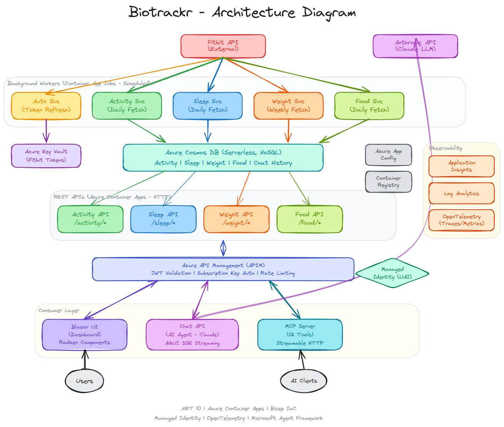

# biotrackr

**biotrackr** is a personal health platform that integrates with the Fitbit API and Withings API to collect, analyze, and provide insights on health and fitness data. The application follows a microservices architecture deployed on Azure, with comprehensive CI/CD pipelines and infrastructure as code.

## 📋 Table of Contents

- [Architecture](#-architecture)
- [Features](#-features)
- [Tech Stack](#-tech-stack)
- [Build Status](#-build-status)
- [License](#-license)

## 🏗️ Architecture

The application follows a **microservices architecture** with separate services for different health domains:

### Data Ingestion (Background Workers)
Scheduled Container App Jobs that fetch data from the Fitbit and Withings APIs:
- **Auth Fitbit Service**: Manages OAuth token refresh with Fitbit API (every 6 hours), storing tokens in Azure Key Vault
- **Auth Withings Service**: Manages OAuth token refresh with Withings API (every 2 hours), storing rotating tokens in Azure Key Vault
- **Activity Service**: Daily fetch of physical activity and workout data from Fitbit
- **Sleep Service**: Daily fetch of sleep tracking and stage analysis data from Fitbit
- **Vitals Service**: Daily fetch of weight, blood pressure, and body composition data from Withings (muscle mass, bone mass, water mass, fat mass, fat-free mass, visceral fat index)
- **Food Service**: Daily fetch of nutrition and food logging data from Fitbit

### Data Access (REST APIs)
HTTP-based Container Apps serving data from Cosmos DB via Azure API Management:
- **Activity API**: Activity data endpoints (`/activity/*`)
- **Sleep API**: Sleep data endpoints (`/sleep/*`)
- **Vitals API**: Vitals data endpoints (`/vitals/*`)
- **Food API**: Food data endpoints (`/food/*`)
- **Reporting API**: Report generation and retrieval endpoints (`/reports/*`) with Copilot SDK lifecycle hooks (ASI02/ASI05), sub-agent specialization (data-analyst, chart-generator, pdf-builder), custom SKILL.md domain knowledge, agent-to-agent auth, and artifact review (ASI09)

### Consumer Layer
- **Chat API**: AI-powered chat agent (Claude via Microsoft Agent Framework) with AGUI SSE streaming, tool policy enforcement, conversation persistence, and graceful degradation when MCP tools are unavailable
- **MCP Server**: [Model Context Protocol](https://modelcontextprotocol.io/) server exposing 12 tools across all health domains via Streamable HTTP transport
- **Reporting API**: Generates PDF reports and chart images from health data using a GitHub Copilot coding agent sidecar with sub-agent orchestration (data-analyst → chart-generator → pdf-builder), custom skills for domain knowledge, lifecycle hooks for security and observability, and AI-driven report review
- **UI**: Blazor Server dashboard with Radzen components for visualizing activity, sleep, vitals, and food data

### Supporting Infrastructure
- **Azure API Management**: API gateway with JWT validation, subscription key auth, and rate limiting
- **Azure Cosmos DB**: Serverless NoSQL database for all health data and chat conversation history
- **Azure Key Vault**: Secure storage for Fitbit and Withings OAuth tokens
- **Azure App Configuration**: Centralized configuration for all services
- **Azure Container Registry**: Docker image storage
- **Azure Blob Storage**: Report artifact storage (PDFs, charts) with SAS URL generation
- **GitHub Copilot**: Coding agent sidecar for Reporting API with sub-agent orchestration (data-analyst, chart-generator, pdf-builder), custom SKILL.md domain knowledge files, SDK lifecycle hooks, and OpenTelemetry instrumentation
- **Managed Identity (UAI)**: Passwordless authentication across all Azure resources
- **Observability**: Application Insights, Log Analytics, OpenTelemetry (traces/metrics), Azure Monitor Alerts, Azure AI Foundry (evaluation)
- **Azure AI Foundry**: GenAIOps evaluation and monitoring — safety evaluators, groundedness checking, and evaluation pipeline via Foundry project in East US 2

## ✨ Features

- 🏃 **Activity Tracking**: Comprehensive workout and activity data collection
- 😴 **Sleep Analysis**: Sleep patterns, stages, and quality metrics
- ⚕️ **Vitals Tracking**: Weight, blood pressure, and body composition tracking with Withings data (muscle mass, bone mass, water mass, fat mass, visceral fat)
- 🍎 **Food Logging**: Nutrition tracking and food diary management
- 🔐 **Secure Authentication**: OAuth integration with Fitbit and Withings
- 📊 **Data Insights**: Analysis and reporting on health metrics
- 📝 **Report Generation**: Automated PDF reports and data visualizations via a Copilot coding agent with sub-agent specialization, custom skills, lifecycle hooks, and AI review
- 💬 **AI Chat Agent**: Natural language chat interface powered by Claude for querying and analysing health data
- 🤖 **MCP Integration**: AI-ready via Model Context Protocol server with 12 tools across all health domains
- �️ **Tool Policy Enforcement**: Per-session tool call limits, tool whitelisting, and rate limiting for AI agent safety
- 🔄 **Graceful Degradation**: Chat API continues operating when MCP tools are unavailable, rebuilding automatically when restored
- 💾 **Conversation Persistence**: Chat history stored in Cosmos DB with message limits and truncation for context management
- 🖥️ **Web Dashboard**: Blazor Server UI with Radzen components for browsing and visualizing health data
- 🧪 **AI Safety Evaluation**: Automated safety + groundedness evaluations via Azure AI Foundry with violence, self-harm, sexual content, and hate/unfairness detection
- ☁️ **Cloud-Native**: Fully deployed on Azure with auto-scaling
- 🚀 **CI/CD**: Automated testing, deployment, and infrastructure management

## 🛠️ Tech Stack

### Backend
- **.NET 10.0**: Modern C# microservices
- **Azure Container Apps**: Serverless compute for background processing
- **Azure Cosmos DB**: NoSQL database for scalable data storage
- **Azure App Configuration**: Centralized configuration management
- **Azure Key Vault**: Secure secrets management
- **Microsoft Agent Framework**: AI agent orchestration with Claude (Anthropic) as the LLM backend

### Infrastructure
- **Bicep**: Infrastructure as Code (IaC) for Azure resources
- **GitHub Actions**: CI/CD pipelines and workflow automation
- **Docker**: Containerization for consistent environments
- **Azure API Management**: API gateway with JWT validation for secure managed identity authentication
- **ModelContextProtocol SDK**: MCP server with Streamable HTTP transport
- **Azure AI Foundry**: GenAIOps evaluation pipeline with safety evaluators

### Frontend
- **Blazor Server**: Interactive server-rendered UI with .NET 10.0
- **OpenTelemetry**: Distributed tracing and metrics

### Testing
- **xUnit**: Unit and integration testing framework
- **FluentAssertions**: Readable test assertions
- **Moq**: Mocking framework for unit tests
- **Cosmos DB Emulator**: Local database testing

##  Build Status

| Component | Deployment Status | Unit Test Coverage | Integration Test Coverage |
| --------- | ----------------- | ------------------ | ------------------------- |
| **Infrastructure** |  | N/A | N/A |
| **Auth Fitbit Service** |  |  |  |
| **Auth Withings Service** |  |  |  |
| **Activity Service** |  |  |  |
| **Activity API** |  |  |  |
| **Sleep API** |  |  |  |
| **Sleep Service** |  |  |  |
| **Vitals API** |  |  |  |
| **Vitals Service** |  |  |  |
| **Food API** |  |  |  |
| **Food Service** |  |  |  |
| **Chat API** |  |  |  |
| **MCP Server** |  |  |  |
| **Reporting API** |  |  |  |
| **AI Evaluation** |  | N/A | N/A |
| **UI** |  |  | N/A |

##  License

This project is licensed under the Apache License 2.0 - see the [LICENSE](LICENSE) file for details.

---

**Author**: [willvelida](https://github.com/willvelida)

*For questions or feedback, please open an issue on this repository.*