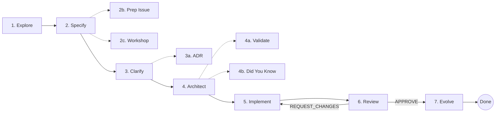

## What Is the Harness

The harness is everything that wraps around the AI model to increase the probability of correct output. It includes convention files that load automatically, agents with built-in verification loops, guided workflows for common tasks, and templates for multi-session work.

You do not need to configure anything. The harness activates when you use GitHub Copilot in VS Code on this repository.

## Getting Started

The fastest way to start is with the dev container. It provides .NET 10.0, Cosmos DB vNext emulator, CLI tools, pre-built services, and 30 seed documents — no manual setup required.

1. Open the repo in VS Code with the [Dev Containers extension](https://marketplace.visualstudio.com/items?itemName=ms-vscode-remote.remote-containers)
2. Run **Dev Containers: Reopen in Container** (`Ctrl+Shift+P`)
3. Wait for setup to complete (restores packages, builds services, seeds Cosmos DB)
4. Start the local stack: `bash scripts/start-local.sh`
5. Open `http://localhost:5239` for the UI

The dev container eliminates the Boot step from the harness — Cosmos DB Emulator, all services, and seed data are ready when the container opens. See `docs/devcontainer-setup.md` for secrets, ports, and troubleshooting.

For manual setup outside the dev container, see the prerequisites in `AGENTS.md`.

## Automatic Context Loading

When you edit a file, Copilot loads convention guides matched by file type. This happens without any action on your part.

| You edit | Copilot loads | Covers |
|----------|---------------|--------|
| `*.cs` | csharp-conventions, dsa-awareness | Naming, DI, error handling, async, data structure selection |
| `*Tests*/**/*.cs` | testing-conventions | xUnit, AAA pattern, naming, coverage, agent-readable assertions |
| `*.bicep` | bicep-conventions | Three-tier layout, parameter conventions, module naming |
| `*.razor` | razor-components | Component structure, Radzen patterns, accessibility |
| `*.razor.css` | css-conventions | CSS isolation, `bt-` prefix, Radzen theming |
| `*.yml` | github-actions-conventions | Action pinning, permissions, OIDC, concurrency |
| `*Repository*.cs`, `*Document*.cs` | cosmos-conventions | Repository pattern, query safety, partition keys, lifetimes |

Two files load on every request regardless of file type:

- `copilot-instructions.md` — project architecture, build commands, security controls, boundary rules
- `AGENTS.md` — universal cross-tool guide with the same content scoped for non-Copilot agents

## Agents

Select an agent from the **chat mode dropdown** at the top of the Copilot Chat panel. Each agent has a specific role and toolset.

### Code Generation Agents

| Agent | When to Use |
|-------|-------------|
| **@C# Expert** | .NET implementation, SOLID design, test writing, performance |
| **@Front-End Designer** | Blazor components, Radzen UI, CSS, accessibility, responsiveness |
| **@Bicep Specialist** | Azure infrastructure templates, Bicep modules |
| **@GitHub Actions Expert** | CI/CD workflows, action security, OIDC configuration |

These four agents include **verification protocols** — after generating code, they run `dotnet build` (or equivalent), check for errors, fix issues, and retry up to 2 times before escalating to you.

### Review and Analysis Agents

| Agent | When to Use |
|-------|-------------|
| **@Code Reviewer** | Pre-push convention check (read-only, cannot modify files) |
| **@Vulnerability Scanner** | OWASP security audit across all applicable frameworks |
| **@DSA Mentor** | Data structure and algorithm learning, complexity analysis |
| **@Azure Principal Architect** | Azure architecture decisions, WAF evaluation |

### Workflow Agents

| Agent | When to Use |
|-------|-------------|
| **@Agentic Workflows** | GitHub Agentic Workflow authoring and management |

### Example: Using the Code Reviewer

Select **Code Reviewer** from the chat mode dropdown, then type:

```text
Review the files I changed in this branch
```

The Code Reviewer loads the relevant `.instructions.md` files for the file types you changed, checks each file against those conventions, and produces a findings table:

| File | Line | Severity | Finding | Fix |
|------|------|----------|---------|-----|
| Handlers.cs | 42 | ERROR | Missing parameterized QueryDefinition | Use QueryDefinition with parameters per cosmos-conventions |

Verdict: **APPROVE** or **REQUEST_CHANGES** (max 2 review cycles).

## Prompts

Invoke a prompt by typing `/` in the chat input and selecting from the list, or attach with `#prompt:name`. Prompts are guided workflows with specific steps.

### Development Prompts

| Prompt | Purpose | Agent |
|--------|---------|-------|
| `/new-endpoint` | Create API endpoint with build/test gates | C# Expert |
| `/cross-service-change` | Coordinate changes across multiple services | C# Expert |
| `/refactor` | Refactor with baseline capture and regression verification | C# Expert |
| `/new-component` | Scaffold Blazor component with accessibility | Front-End Designer |

### Audit Prompts

| Prompt | Purpose | Agent |
|--------|---------|-------|
| `/harness-health` | Audit the harness infrastructure itself | Default chat |
| `/accessibility-audit` | WCAG 2.2 AA compliance check | Front-End Designer |
| `/design-review` | UX quality, responsiveness, and performance review | Front-End Designer |
| `/perf-optimize` | Front-end performance optimization | Front-End Designer |

### DSA Prompts

| Prompt | Purpose | Agent |
|--------|---------|-------|
| `/dsa-code-review` | Review code for algorithmic anti-patterns | DSA Mentor |
| `/dsa-concept-explain` | Deep-explain a DSA concept with Biotrackr examples | DSA Mentor |
| `/dsa-algorithm-design` | Design an algorithm for a given requirement | DSA Mentor |
| `/dsa-performance-analysis` | Profile time/space complexity and suggest optimizations | DSA Mentor |

### Example: Using the New Endpoint Prompt

```text
/new-endpoint GET activity summary by week in Activity.Api
```

The prompt walks through these steps automatically:

1. Identify the target service, handler file, and repository method
2. Generate the handler method following minimal API patterns
3. **Run `dotnet build`** — fix errors before proceeding
4. Generate unit tests with AAA pattern and proper naming
5. **Run `dotnet test` with coverage** — verify pass and coverage >= 70%
6. Fix issues (max 2 retry cycles)
7. Stop and ask you if retries are exhausted

## Multi-Session Work

For tasks that span multiple conversations or services, use the cross-session state management system.

### Complexity Scoring

Before starting work, assess complexity using the CS-1 through CS-5 rubric in `docs/standards/harness-governance.md`:

- **CS-1 or CS-2**: Proceed directly. Single service, familiar patterns.
- **CS-3 and above**: Create an execution plan first. Cross-service, schema changes, or new patterns.

### Execution Plans

For CS-3+ tasks, copy the template and fill it in:

```text
Source: .copilot-tracking/templates/exec-plan-template.md
Target: .copilot-tracking/plans/{feature}-plan.md
```

The template includes sections for purpose, progress checkboxes, current state briefing, decision log, validation commands, and affected services. The **Current State** section is the key bridging mechanism — write a 1-2 paragraph briefing that the next session reads to restore context.

### Progress Files

For lighter-weight session bridging, use the progress template:

```text
Source: .copilot-tracking/templates/progress-template.md
Target: .copilot-tracking/tasks/{task-name}.md
```

Session protocol:

1. **Start**: Read the progress file, find the next unchecked item, verify the build passes
2. **Work**: Complete tasks, check items off, update the Current State section
3. **End**: Add a Session Log entry with duration and outcome

Cap progress files at 200 lines. Archive completed tasks.

## SDD Workflow

Spec-Driven Development (SDD) is a structured development workflow for features that benefit from separating WHAT/WHY from HOW before writing code. The workflow is stack-agnostic — the same prompts work in any repository regardless of language, framework, or toolchain. Each phase is independently useful; you can run the full chain or use individual prompts standalone.

### When to Use SDD

| Complexity | Recommended Approach |
|------------|---------------------|
| CS-1 / CS-2 | Proceed directly with existing prompts (`/new-endpoint`, `/refactor`, etc.) — SDD is optional |
| CS-3 / CS-4 | SDD recommended — Simple mode uses lighter architecture research, Full mode uses complete subagent research |
| CS-5 | SDD strongly recommended — use Full mode (complete subagent research) |

### The Workflow



Dashed lines indicate optional phases. The 7 core phases (solid lines) work standalone.

1. **Explore** (`/sdd-1-explore`) — Research the codebase before writing a spec. Read-only. Produces a research dossier with codebase landscape, existing patterns, dependencies, and integration points. Stops when done.
2. **Specify** (`/sdd-2-specify`) — Write a technology-free specification. WHAT and WHY only, no HOW. Includes acceptance criteria, complexity scoring, and affected modules. Unknowns are marked with `[NEEDS CLARIFICATION]`.
2b. **Prep Issue** (`/sdd-2b-prep-issue`) — *(Optional)* Generate structured GitHub Issue text from the spec for external tracking. Produces copy-paste-ready issue text with goals, acceptance criteria, and complexity.
2c. **Workshop** (`/sdd-2c-workshop`) — *(Optional)* Deep design exploration for topics identified in the spec's Workshop Opportunities table. Produces a design document with options, trade-offs, and recommendations.
3. **Clarify** (`/sdd-3-clarify`) — Resolve ambiguities through 8 or fewer targeted questions. Decides the workflow mode (Simple or Full) and testing approach (Standard, Lightweight, or None per your project conventions).
3a. **ADR** (`/sdd-3a-adr`) — *(Optional)* Generate an Architecture Decision Record when a feature requires decisions that outlive the feature itself. Uses the existing `docs/decision-records/` format.
4. **Architect** (`/sdd-4-architect`) — Generate a phased implementation blueprint. Launches parallel research subagents that gather codebase evidence before analysis. Produces a plan with task tables, discovery findings, and architecture decisions.
4a. **Validate** (`/sdd-4a-validate`) — *(Optional)* Readiness gate that runs parallel validators (structure, completeness, doctrine, dependencies) and issues a READY or NOT READY verdict before implementation.
4b. **Did You Know** (`/sdd-4b-didyouknow`) — *(Optional)* Build shared understanding by surfacing non-obvious insights from SDD artifacts. Presents insights one at a time and immediately updates artifacts after each discussion.
5. **Implement** (`/sdd-5-implement`) — Execute one phase at a time. Delegates to the right agent for the technology being modified. Tracks progress per-task with 4-state checkboxes and verifies build/test after each task.
6. **Review** (`/sdd-6-review`) — Quality gate. Checks spec compliance, convention adherence, test coverage, and cross-module consistency. Issues APPROVE or REQUEST_CHANGES. Also identifies learning candidates as advisory findings that do not affect the verdict.
7. **Evolve** (`/sdd-7-evolve`) — Post-cycle learning extraction. Reads discoveries and decisions from the completed cycle, proposes updates to instruction files. Requires human approval for every change.

You can also select **SDD Workflow** from the chat mode dropdown. The dispatcher agent detects which phase to run next based on what artifacts already exist.

### Skipping Phases

Phases can be skipped. For CS-1/2 tasks (Simple mode), you might skip Explore and Clarify entirely. Each prompt is standalone — you do not need to run the entire chain. The Specify phase is the most valuable standalone use because it forces you to separate WHAT from HOW before coding.

### Design Patterns

#### Doctrine Resolution Protocol

Every SDD prompt starts by resolving project conventions automatically:

1. Looks for project rules files (`copilot-instructions.md`, `AGENTS.md`, `CONTRIBUTING.md`)
2. If nothing found, scans the codebase (dependency manifests, build systems, test frameworks)
3. Extracts build command, test command, coverage threshold, and naming conventions
4. Unknown values become explicit TODOs, never silent assumptions

The prompts never hardcode `dotnet build` or `npm test` — they discover the right commands from your project documentation. The same prompts work in a .NET repo, a Node.js repo, a Rust repo, or anything else.

#### Artifact Chain

Each phase produces a specific artifact that the next phase consumes:

| Phase | Produces | Consumed By |
|-------|----------|-------------|
| 1. Explore | `research-dossier.md` | 2. Specify (optional), 4. Architect |
| 2. Specify | `{slug}-spec.md` | 2b. Prep Issue, 2c. Workshop, 3. Clarify, 4. Architect |
| 2b. Prep Issue | GitHub Issue text (copy-paste) | External tracker |
| 2c. Workshop | `workshops/{topic-slug}.md` | 3. Clarify, 3a. ADR |
| 3. Clarify | Updated spec with Clarifications | 3a. ADR, 4. Architect |
| 3a. ADR | `docs/decision-records/{YYYY-MM-DD}-{title-slug}.md` | 4. Architect |
| 4. Architect | `{slug}-plan.md` (with task tables) | 4a. Validate, 4b. Did You Know, 5. Implement |
| 4a. Validate | READY/NOT READY verdict | 5. Implement |
| 4b. Did You Know | Updated artifacts with insights | 5. Implement |
| 5. Implement | Code + `execution.log.md` | 6. Review |
| 6. Review | `review.md` (APPROVE/REQUEST_CHANGES) | 7. Evolve, or 5. Implement |
| 7. Evolve | Harness updates + evolution log entry | Instruction files |

Artifacts are stored under `.copilot-tracking/plans/{date}/{slug}/`. This enables cross-session continuity — a different session or agent can pick up where the last one left off by reading the artifacts.

#### Technology-Appropriate Delegation

During implementation, the workflow detects the technology of each file being modified and checks if a specialized agent exists. If found, it delegates. If not, it proceeds directly. No agent names are hardcoded in the prompts, so the delegation adapts to whatever agents your repository provides.

#### Harness Evolution (Double-Loop Learning)

Most AI tools fix individual tasks (single-loop learning). The Evolve phase goes further — it questions and modifies the governing instructions themselves (double-loop learning). Discoveries from implementation become permanent conventions.

Safety constraints prevent drift:

* Mandatory human approval for every proposed change
* Size budgets on instruction files (200 lines for path-scoped, 500 lines for project-wide)
* De-duplication checks against existing instructions
* Separate commits for harness changes (distinct from code changes)

The evolution log at `.copilot-tracking/harness-evolution-log.md` tracks every change with provenance: which plan generated the learning, what evidence supports it, and which files were modified. This file is committed to source control so the team can see how the harness improves over time.

### SDD Quick Reference

| I want to...                | Do this                                              |
|-----------------------------|------------------------------------------------------|
| Research before building    | `/sdd-1-explore`                                     |
| Write a feature spec        | `/sdd-2-specify`                                     |
| Generate a GitHub Issue     | `/sdd-2b-prep-issue`                                 |
| Explore a design topic      | `/sdd-2c-workshop`                                   |
| Resolve ambiguities         | `/sdd-3-clarify`                                     |
| Document an architecture decision | `/sdd-3a-adr`                                  |
| Plan implementation phases  | `/sdd-4-architect`                                   |
| Validate plan readiness     | `/sdd-4a-validate`                                   |
| Build shared understanding  | `/sdd-4b-didyouknow`                                 |
| Implement a plan phase      | `/sdd-5-implement`                                   |
| Review before merging       | `/sdd-6-review`                                      |
| Encode lessons learned      | `/sdd-7-evolve`                                      |
| See what phase is next      | Select **SDD Workflow** from chat mode dropdown       |

### Related Files

* SDD prompts: `.github/prompts/`
* SDD skills (Copilot CLI): `.github/skills/sdd-*/`
* Design template: `.copilot-tracking/templates/sdd-design-template.md`
* Evolution log: `.copilot-tracking/harness-evolution-log.md`
* Dispatcher agent: `.github/agents/sdd-workflow.agent.md`

## The Verification Protocol

Every code-generation agent follows the same pattern, modeled on the Bicep Specialist:

```text
Agent generates code
       │
       ▼
   dotnet build ──── fail ──→ agent reads errors, fixes (retry 1)
       │                              │
      pass                       dotnet build ── fail ──→ agent fixes (retry 2)
       │                              │                          │
       ▼                            pass                    fail → STOP
   dotnet test                        │                    ask user
       │                              ▼
      pass + coverage ≥ 70%     continue...
       │
       ▼
   Present result
```

**Bounded iteration**: Maximum 2 retry cycles on any failure. If the agent cannot fix the issue in 2 tries, it stops and presents the error with what it tried and its root cause assessment. This prevents infinite token-burning loops.

## The Steering Loop

When something keeps going wrong across sessions, strengthen the harness rather than repeatedly fixing the same issue:

1. **Convention violation recurs** → Add a rule to the relevant `.instructions.md` file
2. **Agent ignores a pattern** → Add an example to the instruction file or create a structural test with an `AGENT FIX:` assertion message
3. **Complex workflow fails** → Create a new prompt that encodes the correct sequence
4. **Review catches the same issue** → Promote it from the Code Reviewer to a CI check

This is the "encode, don't document" principle: every recurring difficulty becomes an infrastructure fix (a convention rule, a test, a prompt), not a note in a wiki.

## Boot-Interact-Observe Protocol

When validating any change, follow this sequence from `docs/standards/harness-governance.md`:

**Dev Container (recommended):**

The Boot step is handled automatically. Cosmos DB Emulator is running, services are pre-built, and seed data is loaded.

```bash
# Boot (already done by dev container)
bash scripts/start-local.sh          # Start APIs + gateway + UI (if not already running)

# Interact
cd src/Biotrackr.{Domain}.{Type}
dotnet test --no-build                                                  # Unit tests
dotnet test --no-build --filter "FullyQualifiedName~Contract"           # Contract tests
dotnet test --no-build --filter "FullyQualifiedName~E2E"                # E2E tests

# Observe
dotnet test --no-build --collect:"XPlat Code Coverage" --settings ../coverage.runsettings
reportgenerator -reports:"./TestResults/**/coverage.cobertura.xml" -targetdir:"./CoverageReport" -reporttypes:TextSummary
cat ./CoverageReport/Summary.txt
# Verify line coverage ≥ 70%
```

**Manual setup (outside dev container):**

```powershell
# Boot
./cosmos-emulator.ps1 start          # Only if E2E tests are needed
cd src/Biotrackr.{Domain}.{Type}
dotnet build --no-restore -v:q

# Interact
dotnet test --no-build                                                  # Unit tests
dotnet test --no-build --filter "FullyQualifiedName~Contract"           # Contract tests
dotnet test --no-build --filter "FullyQualifiedName~E2E"                # E2E tests

# Observe
dotnet test --no-build --collect:"XPlat Code Coverage" --settings ../coverage.runsettings
reportgenerator -reports:"./TestResults/**/coverage.cobertura.xml" -targetdir:"./CoverageReport" -reporttypes:TextSummary
Get-Content ./CoverageReport/Summary.txt
# Verify line coverage ≥ 70%
```

## Periodic Maintenance

Run these periodically to keep the harness healthy:

| Task | Frequency | How |
|------|-----------|-----|
| Harness health audit | Monthly | `/harness-health` prompt |
| Convention spot-check | Monthly | Sample 3 recent files against `.instructions.md` rules |
| Security scan | Per PR (automated) | CodeQL and dependency review in CI |
| OWASP audit | Quarterly | Select **Vulnerability Scanner** from chat mode dropdown |

## Quick Reference

| I want to... | Do this |
|--------------|---------|
| Write a new endpoint | `/new-endpoint` |
| Change multiple services | `/cross-service-change` |
| Refactor safely | `/refactor` |
| Review before pushing | Select **Code Reviewer** from chat mode dropdown |
| Build a Blazor component | `/new-component` |
| Check accessibility | `/accessibility-audit` |
| Audit harness health | `/harness-health` |
| Plan a complex feature | Copy `.copilot-tracking/templates/exec-plan-template.md` |
| Track multi-session work | Copy `.copilot-tracking/templates/progress-template.md` |
| Plan with SDD workflow | Select **SDD Workflow** from chat mode dropdown |
| Learn DSA concepts | Select **DSA Mentor** from chat mode dropdown |
| Run security scan | Select **Vulnerability Scanner** from chat mode dropdown |

## Related Documents

- `docs/standards/harness-governance.md` — Governance framework, maturity model, complexity scoring, QITE measurement
- `.github/copilot-instructions.md` — Full project context (architecture, conventions, security, boundaries)
- `AGENTS.md` — Universal cross-tool agent guide
