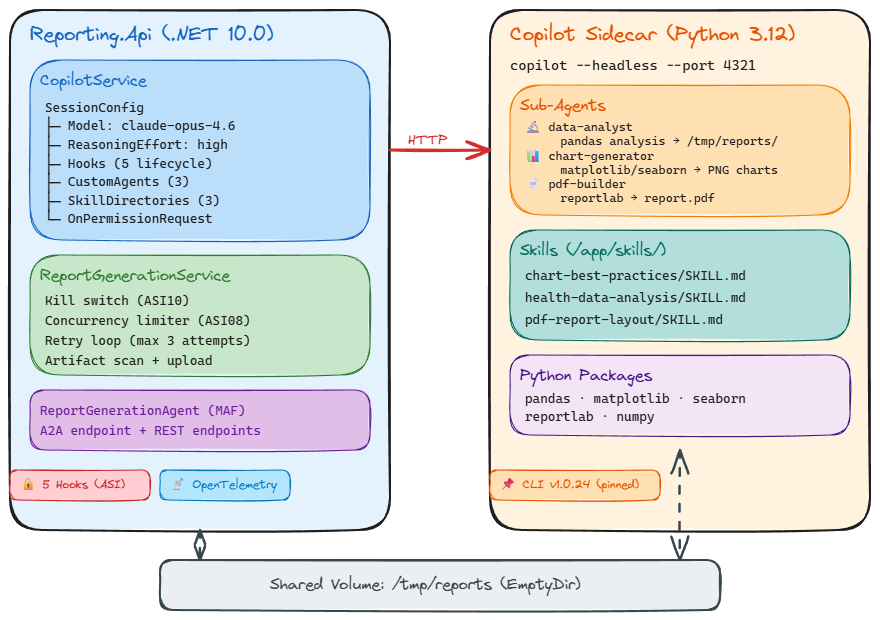

# Biotrackr Reporting API

The Reporting API generates professional PDF health reports and chart visualizations from Fitbit and Withings data using a **GitHub Copilot coding agent sidecar** with sub-agent specialization, custom domain skills, and SDK lifecycle hooks.

## Architecture



## Sub-Agent Orchestration

The Copilot session uses 3 specialized sub-agents that the runtime auto-delegates to based on the task:

| Agent | Role | Description |
|-------|------|-------------|
| **data-analyst** | Health Data Analyst | Analyzes fitness data using pandas — metrics, goals, trends, standout days |
| **chart-generator** | Chart Generator | Creates matplotlib/seaborn visualizations — PNG charts for all metrics |
| **pdf-builder** | PDF Report Builder | Assembles multi-page reportlab PDF — tables, embedded charts, disclaimers |

The orchestration flow is: `data-analyst` → `chart-generator` → `pdf-builder`, with results chained via the `read_agent` tool. Each sub-agent writes output to `/tmp/reports/` (shared EmptyDir volume).

## Custom Skills

Three SKILL.md files provide domain knowledge to the Copilot session:

| Skill | Content |
|-------|---------|
| `chart-best-practices` | matplotlib Agg backend, seaborn themes, DPI/sizing, goal lines, annotations |
| `health-data-analysis` | Biotrackr JSON schema, metric extraction, duration conversion, goal definitions |
| `pdf-report-layout` | reportlab PLATYPUS patterns, page structure, table styling, disclaimer footer |

Skills are baked into the sidecar Docker image at `/app/skills/` and loaded via `SessionConfig.SkillDirectories`.

## SDK Lifecycle Hooks

Five hooks provide security and observability controls:

| Hook | Purpose |
|------|---------|
| `OnPreToolUse` | Tool-name allow-list + `/tmp/reports` path restriction (ASI02/ASI05) |
| `OnPostToolUse` | Real-time dangerous code pattern detection in shell results (ASI05) |
| `OnErrorOccurred` | Structured retry for transient errors (ASI08) |
| `OnSessionStart` | Session lifecycle telemetry logging |
| `OnSessionEnd` | Session lifecycle telemetry logging |

## Security Controls

| Control | OWASP Category | Implementation |
|---------|---------------|----------------|
| ASI01 | Agent Goal Hijack | Prompt injection blocklist (14 patterns), 5000-char task message limit |
| ASI02 | Tool Misuse | `OnPreToolUse` hook with tool-name allow-list and path restriction |
| ASI04 | Supply Chain | Copilot CLI pinned to `VERSION=1.0.24` with SHA256 checksum |
| ASI05 | Code Execution | `OnPostToolUse` real-time scan (18 dangerous patterns) + defense-in-depth `ValidateGeneratedCode` |
| ASI08 | Cascading Failures | Concurrency limiter (max 3 jobs), 15-min timeout, structured retry via hook |
| ASI09 | Trust Exploitation | Mandatory disclaimer on every PDF page via `onPage` callback |
| ASI10 | Rogue Agents | Kill switch, 50MB artifact size limit, anomalous file type logging |

## Endpoints

| Method | Path | Auth | Purpose |
|--------|------|------|---------|
| GET | `/api/healthz` | Anonymous | Health check |
| POST | `/api/reports/generate` | ChatApiAgent JWT | Start async report generation (returns 202) |
| GET | `/api/reports` | ChatApiAgent JWT | List reports with optional filters |
| GET | `/api/reports/{jobId}` | ChatApiAgent JWT | Get report metadata + SAS URLs |
| POST | `/a2a/report` | ChatApiAgent JWT | A2A agent protocol endpoint |

## Configuration

All settings are loaded via Azure App Configuration with Key Vault references:

| Setting | Description | Default |
|---------|-------------|---------|
| `CopilotCliUrl` | Sidecar URL | `http://localhost:4321` |
| `ReportGeneratorSystemPrompt` | Orchestrator system prompt (Key Vault) | — |
| `ReportGenerationEnabled` | Kill switch (ASI10) | `true` |
| `MaxConcurrentJobs` | Concurrency limit (ASI08) | `3` |
| `ReportGenerationTimeoutMinutes` | Job timeout (ASI08) | `15` |
| `MaxArtifactSizeBytes` | Artifact size limit (ASI10) | `52428800` (50 MB) |

## Project Structure

```text
src/Biotrackr.Reporting.Api/
├── Biotrackr.Reporting.Api/
│   ├── Agents/
│   │   └── ReportGenerationAgent.cs        # MAF AIAgent with ContinuationToken polling
│   ├── Configuration/
│   │   └── Settings.cs                     # Service settings
│   ├── Endpoints/
│   │   ├── A2AEndpoints.cs                 # A2A protocol endpoint
│   │   ├── GenerateEndpoints.cs            # POST /api/reports/generate
│   │   └── ReportEndpoints.cs              # GET /api/reports, /api/reports/{jobId}
│   ├── Models/
│   │   ├── A2AModels.cs                    # ReportJobResult
│   │   ├── ReportJobContinuation.cs        # Continuation token
│   │   └── ReportMetadata.cs               # Report status and metadata
│   ├── Services/
│   │   ├── BlobStorageService.cs           # Azure Blob Storage operations
│   │   ├── CopilotService.cs              # Copilot SDK wrapper (hooks, agents, skills, telemetry)
│   │   └── ReportGenerationService.cs      # Report generation pipeline
│   ├── Validation/
│   │   ├── ReportRequestValidator.cs       # Input validation + injection detection
│   │   └── SnapshotValidator.cs            # Source data snapshot validation
│   └── Program.cs                          # Service registration and middleware
├── Biotrackr.Reporting.Api.UnitTests/      # 165 unit tests
├── Biotrackr.Reporting.Api.IntegrationTests/ # 17 contract tests
├── skills/                                  # Copilot SDK skill definitions
│   ├── chart-best-practices/SKILL.md
│   ├── health-data-analysis/SKILL.md
│   └── pdf-report-layout/SKILL.md
├── Dockerfile                               # Main API container
├── Dockerfile.sidecar                       # Copilot CLI + Python sidecar
└── Biotrackr.Reporting.Api.slnx             # Solution file
```

## Build and Test

```bash
cd src/Biotrackr.Reporting.Api

# Build
dotnet restore
dotnet build --no-restore

# Unit tests
dotnet test --no-build

# Tests with coverage
dotnet test --no-build --collect:"XPlat Code Coverage" --settings coverage.runsettings

# Docker sidecar build
docker build -f Dockerfile.sidecar -t biotrackr-reporting-sidecar:local .
```

## Dependencies

| Package | Version | Purpose |
|---------|---------|---------|
| `GitHub.Copilot.SDK` | 0.2.2 | Copilot CLI communication, hooks, sub-agents, skills |
| `Microsoft.Agents.AI.Hosting` | 1.0.0-preview.260311.1 | MAF agent hosting |
| `Microsoft.Agents.AI.Hosting.A2A.AspNetCore` | 1.0.0-preview.260311.1 | A2A protocol |
| `Azure.Storage.Blobs` | 12.24.0 | Report artifact storage |
| `Azure.Identity` | 1.18.0 | Managed identity auth |
